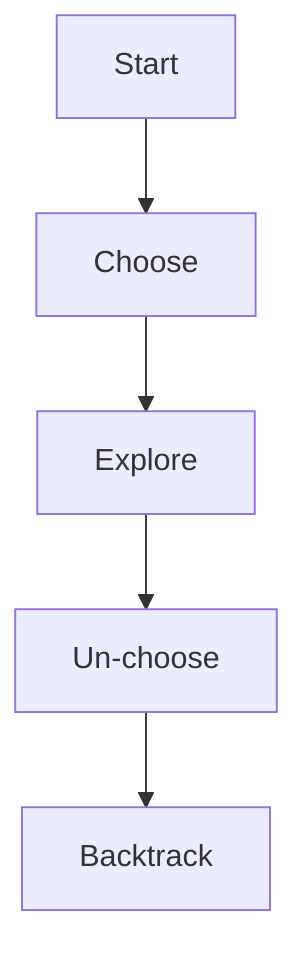

# Backtracking Pattern

## What is it?
A technique for solving problems incrementally, abandoning solutions that fail to satisfy constraints ("explore, choose, un-choose").

## When to Use
- Permutations and combinations
- N-Queens, Sudoku
- Subset and partition problems

## Pseudocode
```text
def backtrack(path, options):
    if goal reached:
        result.append(path)
        return
    for option in options:
        choose(option)
        backtrack(path + [option], remaining options)
        unchoose(option)
```

## Classic LeetCode Examples
- [Permutations (LC 46)](https://leetcode.com/problems/permutations/)
- [Combination Sum (LC 39)](https://leetcode.com/problems/combination-sum/)

### Example: Permutations
```python
def permute(nums):
    res = []
    def backtrack(path, options):
        if not options:
            res.append(path)
            return
        for i in range(len(options)):
            backtrack(path + [options[i]], options[:i] + options[i+1:])
    backtrack([], nums)
    return res
```

## Tips
- Use recursion with "choose, explore, un-choose"
- Prune branches early if constraints are violated

## Mermaid Diagram

