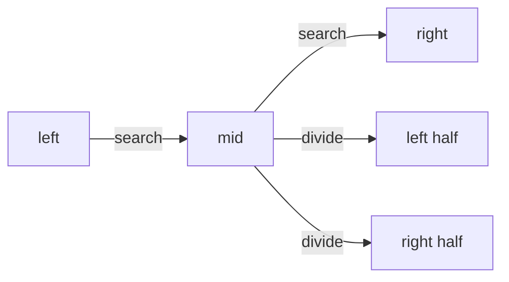

# Binary Search Pattern

## What is it?
A divide-and-conquer technique for searching sorted arrays/lists in O(log n) time by repeatedly dividing the search interval in half.

## When to Use
- Searching in sorted arrays/lists
- Finding boundaries (first/last occurrence)
- Search in rotated sorted arrays

## Pseudocode
```text
left = 0
right = len(array) - 1
while left <= right:
    mid = (left + right) // 2
    if array[mid] == target:
        return mid
    elif array[mid] < target:
        left = mid + 1
    else:
        right = mid - 1
return -1
```

## Classic LeetCode Examples
- [Binary Search (LC 704)](https://leetcode.com/problems/binary-search/)
- [Find Minimum in Rotated Sorted Array (LC 153)](https://leetcode.com/problems/find-minimum-in-rotated-sorted-array/)

### Example: Binary Search
```python
def binary_search(array, target):
    left, right = 0, len(array) - 1
    while left <= right:
        mid = (left + right) // 2
        if array[mid] == target:
            return mid
        elif array[mid] < target:
            left = mid + 1
        else:
            right = mid - 1
    return -1
```

## Tips
- Use for sorted data
- Modify for lower/upper bounds or rotated arrays

## Mermaid Diagram

