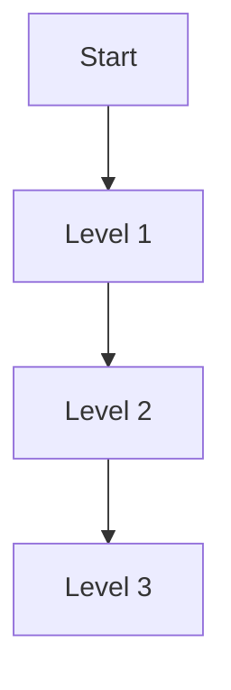

# Breadth-First Search (BFS) Pattern

## What is it?
A graph/tree traversal technique that explores all neighbors at the current depth before moving to the next level, typically using a queue.

## When to Use
- Shortest path in unweighted graphs
- Level order traversal of trees
- Connected components in graphs

## Pseudocode
```text
queue = [start]
visited = set([start])
while queue:
    node = queue.pop(0)
    for neighbor in node.neighbors:
        if neighbor not in visited:
            queue.append(neighbor)
            visited.add(neighbor)
```

## Classic LeetCode Examples
- [Binary Tree Level Order Traversal (LC 102)](https://leetcode.com/problems/binary-tree-level-order-traversal/)
- [Word Ladder (LC 127)](https://leetcode.com/problems/word-ladder/)

### Example: Level Order Traversal
```python
from collections import deque

def level_order(root):
    if not root:
        return []
    result = []
    queue = deque([root])
    while queue:
        level = []
        for _ in range(len(queue)):
            node = queue.popleft()
            level.append(node.val)
            if node.left:
                queue.append(node.left)
            if node.right:
                queue.append(node.right)
        result.append(level)
    return result
```

## Tips
- Use a queue for BFS
- Good for shortest path and level order problems

## Mermaid Diagram

