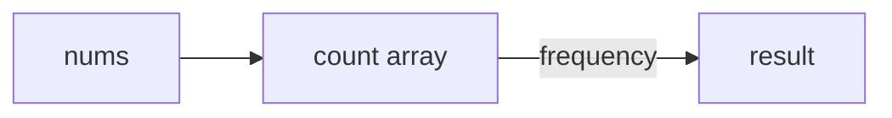

# Counting / Frequency Arrays Pattern

## What is it?
A technique for counting occurrences of elements using an array (or list) as a frequency counter, often for small integer ranges.

## When to Use
- Counting sort
- Frequency of characters/numbers

## Pseudocode
```text
count = [0] * (max_value + 1)
for num in nums:
    count[num] += 1
```

## Classic LeetCode Examples
- [Sort Colors (LC 75)](https://leetcode.com/problems/sort-colors/)
- [Find All Duplicates in an Array (LC 442)](https://leetcode.com/problems/find-all-duplicates-in-an-array/)

### Example: Sort Colors
```python
def sort_colors(nums):
    count = [0] * 3
    for num in nums:
        count[num] += 1
    i = 0
    for color in range(3):
        for _ in range(count[color]):
            nums[i] = color
            i += 1
```

## Tips
- Use for small integer ranges
- Efficient for counting and sorting

## Mermaid Diagram


