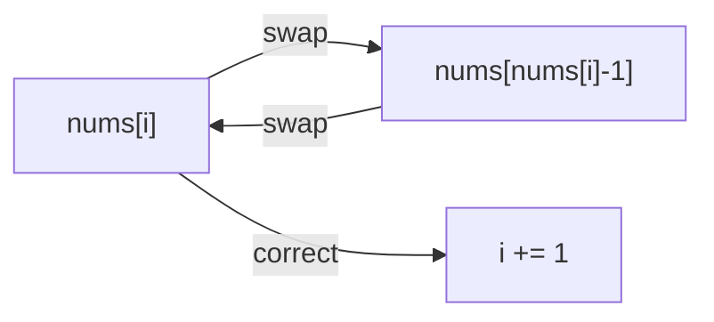

# Cyclic Sort Pattern

## What is it?
A pattern for efficiently placing numbers in their correct indices in an array containing numbers in a known range (often 0 to n or 1 to n).

## When to Use
- Finding missing or duplicate numbers in a range
- Problems where numbers are in a known range

## Pseudocode
```text
i = 0
while i < len(nums):
    correct = nums[i] - 1
    if nums[i] != nums[correct]:
        swap(nums, i, correct)
    else:
        i += 1
```

## Classic LeetCode Examples
- [Find All Numbers Disappeared in an Array (LC 448)](https://leetcode.com/problems/find-all-numbers-disappeared-in-an-array/)
- [Set Mismatch (LC 645)](https://leetcode.com/problems/set-mismatch/)

### Example: Find All Numbers Disappeared in an Array
```python
def find_disappeared_numbers(nums):
    i = 0
    while i < len(nums):
        correct = nums[i] - 1
        if nums[i] != nums[correct]:
            nums[i], nums[correct] = nums[correct], nums[i]
        else:
            i += 1
    return [i + 1 for i in range(len(nums)) if nums[i] != i + 1]
```

## Tips
- Use when numbers are in a fixed range and you need to find missing/duplicate values
- Avoids extra space and works in O(n) time

## Mermaid Diagram

