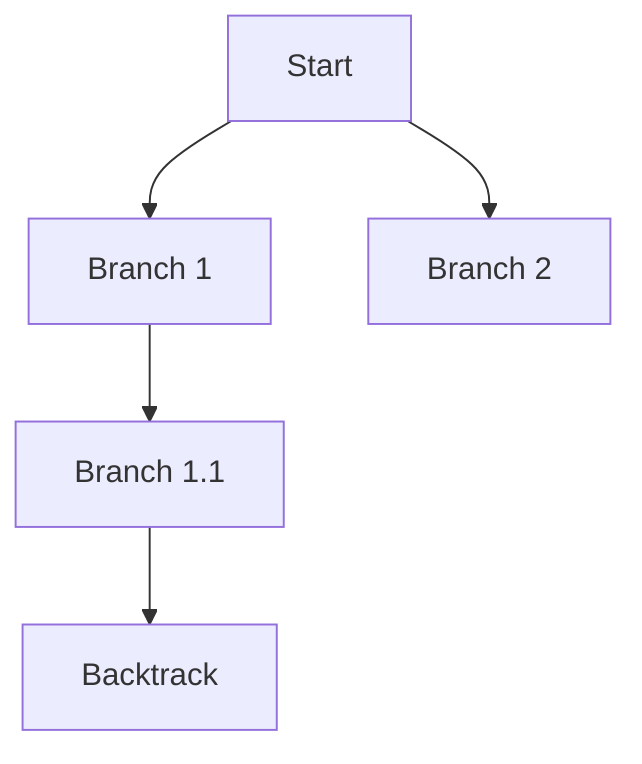

# Depth-First Search (DFS) Pattern

## What is it?
A graph/tree traversal technique that explores as far as possible along each branch before backtracking, typically using recursion or a stack.

## When to Use
- Tree/graph traversal
- Backtracking problems
- Connected components

## Pseudocode
```text
def dfs(node, visited):
    if node in visited:
        return
    visited.add(node)
    for neighbor in node.neighbors:
        dfs(neighbor, visited)
```

## Classic LeetCode Examples
- [Number of Islands (LC 200)](https://leetcode.com/problems/number-of-islands/)
- [Clone Graph (LC 133)](https://leetcode.com/problems/clone-graph/)

### Example: Number of Islands
```python
def num_islands(grid):
    def dfs(r, c):
        if r < 0 or r >= len(grid) or c < 0 or c >= len(grid[0]) or grid[r][c] != '1':
            return
        grid[r][c] = '0'
        dfs(r+1, c)
        dfs(r-1, c)
        dfs(r, c+1)
        dfs(r, c-1)
    count = 0
    for r in range(len(grid)):
        for c in range(len(grid[0])):
            if grid[r][c] == '1':
                dfs(r, c)
                count += 1
    return count
```

## Tips
- Use recursion or a stack for DFS
- Good for exploring all possible paths

## Mermaid Diagram

