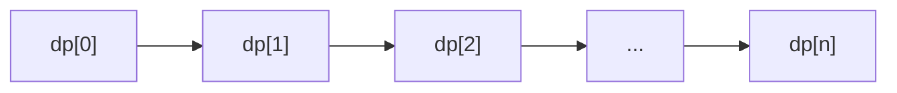

# Dynamic Programming (1D) Pattern

## What is it?
A technique for solving problems by breaking them down into overlapping subproblems and storing the results of subproblems to avoid redundant computation (usually with a 1D array).

## When to Use
- Fibonacci numbers
- Climbing stairs
- House robber

## Pseudocode
```text
dp = [0] * (n+1)
dp[0] = base_case
for i in range(1, n+1):
    dp[i] = function_of_previous_states
return dp[n]
```

## Classic LeetCode Examples
- [Climbing Stairs (LC 70)](https://leetcode.com/problems/climbing-stairs/)
- [House Robber (LC 198)](https://leetcode.com/problems/house-robber/)

### Example: Climbing Stairs
```python
def climb_stairs(n):
    if n <= 2:
        return n
    dp = [0] * (n+1)
    dp[1], dp[2] = 1, 2
    for i in range(3, n+1):
        dp[i] = dp[i-1] + dp[i-2]
    return dp[n]
```

## Tips
- Use for problems with optimal substructure and overlapping subproblems
- Optimize space if only a few previous states are needed

## Mermaid Diagram

