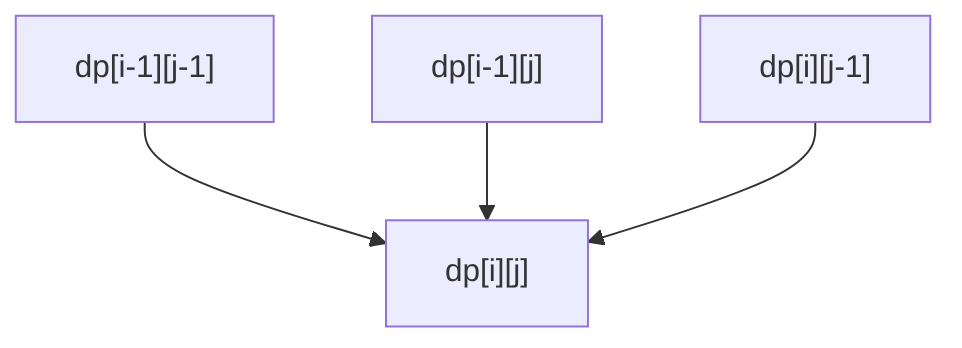

# Dynamic Programming (2D/Matrix) Pattern

## What is it?
A technique for solving problems by breaking them down into overlapping subproblems and storing the results in a 2D table (matrix).

## When to Use
- Longest common subsequence
- Edit distance
- Knapsack

## Pseudocode
```text
dp = [[0] * (n+1) for _ in range(m+1)]
for i in range(1, m+1):
    for j in range(1, n+1):
        dp[i][j] = function_of_neighbors
return dp[m][n]
```

## Classic LeetCode Examples
- [Longest Common Subsequence (LC 1143)](https://leetcode.com/problems/longest-common-subsequence/)
- [Edit Distance (LC 72)](https://leetcode.com/problems/edit-distance/)

### Example: Longest Common Subsequence
```python
def longest_common_subsequence(text1, text2):
    m, n = len(text1), len(text2)
    dp = [[0] * (n+1) for _ in range(m+1)]
    for i in range(1, m+1):
        for j in range(1, n+1):
            if text1[i-1] == text2[j-1]:
                dp[i][j] = dp[i-1][j-1] + 1
            else:
                dp[i][j] = max(dp[i-1][j], dp[i][j-1])
    return dp[m][n]
```

## Tips
- Use for problems with two sequences or grids
- Optimize space if only previous row/column is needed

## Mermaid Diagram

