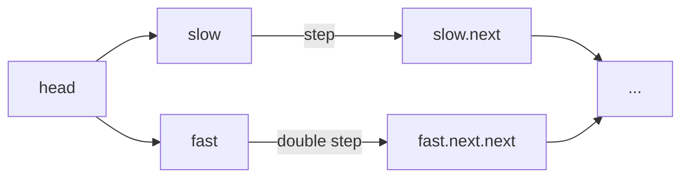

# Fast & Slow Pointers (Tortoise and Hare)

## What is it?
A technique where two pointers move at different speeds to detect cycles or find the middle of a linked list or array.

## When to Use
- Detecting cycles in linked lists or arrays
- Finding the middle of a linked list
- Removing cycles

## Pseudocode
```text
slow = head
fast = head
while fast and fast.next:
    slow = slow.next
    fast = fast.next.next
    if slow == fast:
        # Cycle detected
        break
```

## Classic LeetCode Examples
- [Linked List Cycle (LC 141)](https://leetcode.com/problems/linked-list-cycle/)
- [Find the Duplicate Number (LC 287)](https://leetcode.com/problems/find-the-duplicate-number/)

### Example: Linked List Cycle
```python
def has_cycle(head):
    slow = fast = head
    while fast and fast.next:
        slow = slow.next
        fast = fast.next.next
        if slow == fast:
            return True
    return False
```

## Tips
- Use for problems involving cycles or finding the midpoint
- Fast pointer moves 2x speed of slow pointer

## Mermaid Diagram

