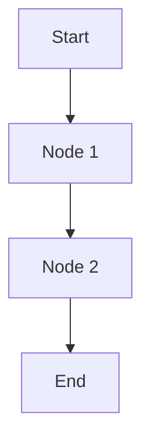

# Graph Shortest Path Pattern

## What is it?
A technique for finding the shortest path between nodes in a weighted graph (Dijkstra, Bellman-Ford, etc.).

## When to Use
- Weighted graphs
- Shortest path problems

## Pseudocode (Dijkstra)
```text
import heapq
dist = {node: inf for node in graph}
dist[start] = 0
heap = [(0, start)]
while heap:
    curr_dist, node = heapq.heappop(heap)
    for neighbor, weight in graph[node]:
        if curr_dist + weight < dist[neighbor]:
            dist[neighbor] = curr_dist + weight
            heapq.heappush(heap, (dist[neighbor], neighbor))
```

## Classic LeetCode Examples
- [Network Delay Time (LC 743)](https://leetcode.com/problems/network-delay-time/)
- [Cheapest Flights Within K Stops (LC 787)](https://leetcode.com/problems/cheapest-flights-within-k-stops/)

### Example: Dijkstra's Algorithm
```python
import heapq

def dijkstra(graph, start):
    dist = {node: float('inf') for node in graph}
    dist[start] = 0
    heap = [(0, start)]
    while heap:
        curr_dist, node = heapq.heappop(heap)
        for neighbor, weight in graph[node]:
            if curr_dist + weight < dist[neighbor]:
                dist[neighbor] = curr_dist + weight
                heapq.heappush(heap, (dist[neighbor], neighbor))
    return dist
```

## Tips
- Use a min-heap for Dijkstra
- Bellman-Ford handles negative weights

## Mermaid Diagram


