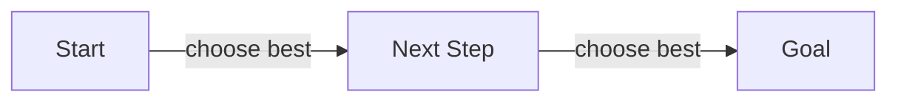

# Greedy Algorithms Pattern

## What is it?
A technique that builds up a solution piece by piece, always choosing the next piece that offers the most immediate benefit.

## When to Use
- Interval scheduling
- Coin change (when greedy works)
- Activity selection

## Pseudocode
```text
Sort items by value/weight/finish time
for item in items:
    if can select item:
        select item
```

## Classic LeetCode Examples
- [Jump Game (LC 55)](https://leetcode.com/problems/jump-game/)
- [Non-overlapping Intervals (LC 435)](https://leetcode.com/problems/non-overlapping-intervals/)

### Example: Jump Game
```python
def can_jump(nums):
    max_reach = 0
    for i, num in enumerate(nums):
        if i > max_reach:
            return False
        max_reach = max(max_reach, i + num)
    return True
```

## Tips
- Greedy is not always optimal—prove correctness
- Sort by the right criteria

## Mermaid Diagram

