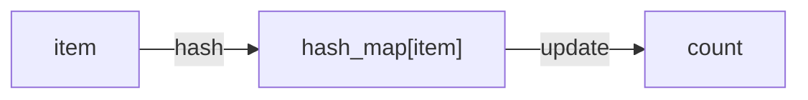

# Hash Map Pattern

## What is it?
A technique for solving problems using hash tables (dictionaries) to store and retrieve values in constant time.

## When to Use
- Frequency counting
- Two sum, anagrams, grouping

## Pseudocode
```text
hash_map = {}
for item in items:
    if item in hash_map:
        hash_map[item] += 1
    else:
        hash_map[item] = 1
```

## Classic LeetCode Examples
- [Two Sum (LC 1)](https://leetcode.com/problems/two-sum/)
- [Group Anagrams (LC 49)](https://leetcode.com/problems/group-anagrams/)

### Example: Two Sum
```python
def two_sum(nums, target):
    lookup = {}
    for i, num in enumerate(nums):
        if target - num in lookup:
            return [lookup[target - num], i]
        lookup[num] = i
```

## Tips
- Use for fast lookups and frequency counting
- Keys can be numbers, strings, tuples, etc.

## Mermaid Diagram


