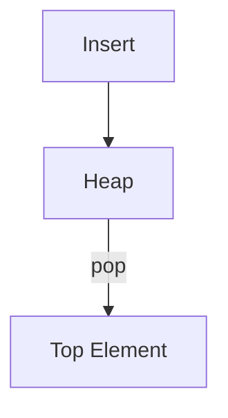

# Heap / Priority Queue Pattern

## What is it?
A data structure that allows efficient retrieval of the minimum or maximum element, often used for top-K problems.

## When to Use
- Kth largest/smallest element
- Merging sorted lists
- Median finder

## Pseudocode
```text
import heapq
heap = []
for item in items:
    heapq.heappush(heap, item)
    if len(heap) > k:
        heapq.heappop(heap)
```

## Classic LeetCode Examples
- [Kth Largest Element in an Array (LC 215)](https://leetcode.com/problems/kth-largest-element-in-an-array/)
- [Merge k Sorted Lists (LC 23)](https://leetcode.com/problems/merge-k-sorted-lists/)

### Example: Kth Largest Element
```python
import heapq

def find_kth_largest(nums, k):
    heap = []
    for num in nums:
        heapq.heappush(heap, num)
        if len(heap) > k:
            heapq.heappop(heap)
    return heap[0]
```

## Tips
- Use min-heap for Kth largest, max-heap for Kth smallest (invert values)
- Python's heapq is a min-heap

## Mermaid Diagram


