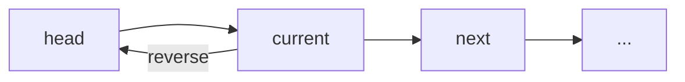

# In-place Reversal of a Linked List

## What is it?
A pattern for reversing a linked list or a part of it in-place, without using extra space.

## When to Use
- Reverse a whole or part of a linked list
- Check if a linked list is a palindrome
- Rotate a linked list

## Pseudocode
```text
prev = None
current = head
while current:
    next = current.next
    current.next = prev
    prev = current
    current = next
return prev
```

## Classic LeetCode Examples
- [Reverse Linked List (LC 206)](https://leetcode.com/problems/reverse-linked-list/)
- [Reverse Linked List II (LC 92)](https://leetcode.com/problems/reverse-linked-list-ii/)

### Example: Reverse Linked List
```python
def reverse_list(head):
    prev = None
    current = head
    while current:
        next = current.next
        current.next = prev
        prev = current
        current = next
    return prev
```

## Tips
- Use for in-place reversal, palindrome check, or rotation
- Carefully manage pointers to avoid losing nodes

## Mermaid Diagram

