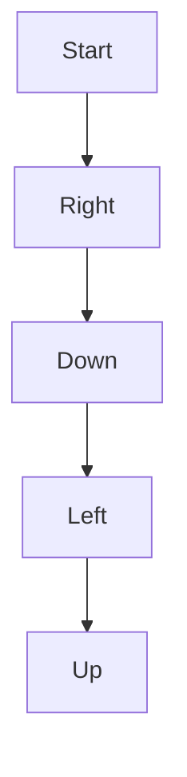

# Matrix Traversal Pattern

## What is it?
A technique for visiting all elements in a 2D grid/matrix in a specific order (row-wise, column-wise, spiral, etc.).

## When to Use
- Grid/board problems
- Islands, flood fill, spiral order

## Pseudocode
```text
for i in range(rows):
    for j in range(cols):
        process(matrix[i][j])
```

## Classic LeetCode Examples
- [Spiral Matrix (LC 54)](https://leetcode.com/problems/spiral-matrix/)
- [Number of Islands (LC 200)](https://leetcode.com/problems/number-of-islands/)

### Example: Spiral Order
```python
def spiral_order(matrix):
    result = []
    while matrix:
        result += matrix.pop(0)
        if matrix and matrix[0]:
            for row in matrix:
                result.append(row.pop())
        if matrix:
            result += matrix.pop()[::-1]
        if matrix and matrix[0]:
            for row in matrix[::-1]:
                result.append(row.pop(0))
    return result
```

## Tips
- Use visited set for DFS/BFS in grids
- Handle edge cases for boundaries

## Mermaid Diagram


