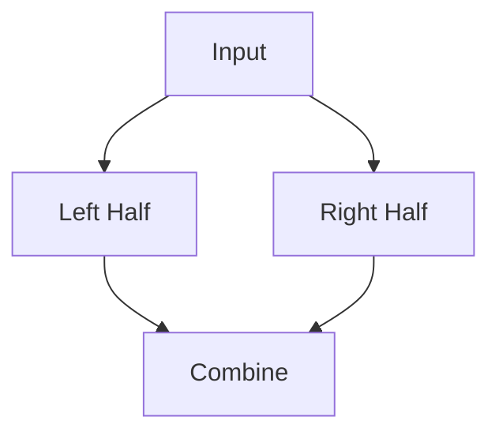

# Meet in the Middle Pattern

## What is it?
A technique for solving problems by dividing the input into two halves, processing each half, and combining results, often used for subset/sum problems.

## When to Use
- Subset sum
- Problems with exponential search space

## Pseudocode
```text
# Split array into two halves
# Generate all possible sums for each half
# Use hash map or binary search to combine results
```

## Classic LeetCode Examples
- [Partition to K Equal Sum Subsets (LC 698)](https://leetcode.com/problems/partition-to-k-equal-sum-subsets/)
- [Minimum Difference in Sums After Removal of Elements (LC 1982)](https://leetcode.com/problems/minimum-difference-in-sums-after-removal-of-elements/)

### Example: Subset Sum
```python
from itertools import combinations

def subset_sums(nums):
    n = len(nums)
    left, right = nums[:n//2], nums[n//2:]
    left_sums = set(sum(comb) for r in range(len(left)+1) for comb in combinations(left, r))
    right_sums = set(sum(comb) for r in range(len(right)+1) for comb in combinations(right, r))
    # Combine left_sums and right_sums as needed
    return left_sums, right_sums
```

## Tips
- Use for problems with n up to 40
- Reduces time complexity from O(2^n) to O(2^(n/2))

## Mermaid Diagram


