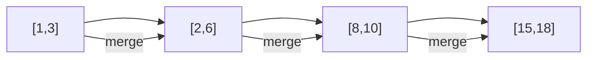

# Merge Intervals Pattern

## What is it?
A pattern for solving problems involving overlapping intervals by sorting and merging them.

## When to Use
- Calendar/meeting room problems
- Merging overlapping intervals
- Finding free time slots

## Pseudocode
```text
Sort intervals by start time
merged = []
for interval in intervals:
    if merged is empty or merged[-1][1] < interval[0]:
        merged.append(interval)
    else:
        merged[-1][1] = max(merged[-1][1], interval[1])
```

## Classic LeetCode Examples
- [Merge Intervals (LC 56)](https://leetcode.com/problems/merge-intervals/)
- [Insert Interval (LC 57)](https://leetcode.com/problems/insert-interval/)

### Example: Merge Intervals
```python
def merge(intervals):
    intervals.sort(key=lambda x: x[0])
    merged = []
    for interval in intervals:
        if not merged or merged[-1][1] < interval[0]:
            merged.append(interval)
        else:
            merged[-1][1] = max(merged[-1][1], interval[1])
    return merged
```

## Tips
- Always sort intervals by start time first
- Useful for range merging, calendar, and timeline problems

## Mermaid Diagram

