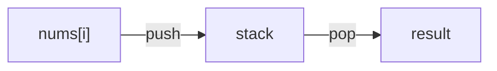

# Monotonic Stack/Queue Pattern

## What is it?
A technique using a stack or queue that is always increasing or decreasing, useful for next greater/smaller element problems.

## When to Use
- Next greater/smaller element
- Stock span, sliding window maximum

## Pseudocode
```text
stack = []
for i in range(len(nums)):
    while stack and nums[stack[-1]] < nums[i]:
        stack.pop()
    stack.append(i)
```

## Classic LeetCode Examples
- [Daily Temperatures (LC 739)](https://leetcode.com/problems/daily-temperatures/)
- [Sliding Window Maximum (LC 239)](https://leetcode.com/problems/sliding-window-maximum/)

### Example: Next Greater Element
```python
def next_greater_elements(nums):
    res = [-1] * len(nums)
    stack = []
    for i in range(len(nums)):
        while stack and nums[stack[-1]] < nums[i]:
            res[stack.pop()] = nums[i]
        stack.append(i)
    return res
```

## Tips
- Use for problems with "next greater/smaller" in O(n)
- Stack/queue is monotonic (increasing or decreasing)

## Mermaid Diagram


