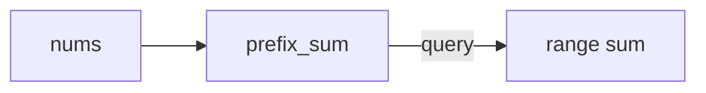

# Prefix Sum / Difference Array Pattern

## What is it?
A technique for quickly calculating the sum of elements in a subarray or range by precomputing prefix sums or using a difference array.

## When to Use
- Range sum queries
- Subarray sum equals k

## Pseudocode
```text
prefix_sum = [0]
for num in nums:
    prefix_sum.append(prefix_sum[-1] + num)
# sum of nums[i:j] = prefix_sum[j] - prefix_sum[i]
```

## Classic LeetCode Examples
- [Range Sum Query - Immutable (LC 303)](https://leetcode.com/problems/range-sum-query-immutable/)
- [Subarray Sum Equals K (LC 560)](https://leetcode.com/problems/subarray-sum-equals-k/)

### Example: Range Sum Query
```python
class NumArray:
    def __init__(self, nums):
        self.prefix_sum = [0]
        for num in nums:
            self.prefix_sum.append(self.prefix_sum[-1] + num)
    def sumRange(self, i, j):
        return self.prefix_sum[j+1] - self.prefix_sum[i]
```

## Tips
- Use prefix sums for fast range queries
- Difference arrays for range updates

## Mermaid Diagram


