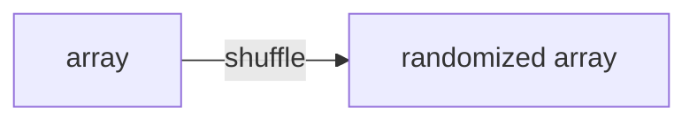

# Randomized Algorithms Pattern

## What is it?
A technique that uses randomization to solve problems efficiently or with high probability.

## When to Use
- Randomized quicksort
- Random pick, shuffle

## Pseudocode
```text
import random
random.shuffle(array)
# or
pivot = random.choice(array)
```

## Classic LeetCode Examples
- [Random Pick with Weight (LC 528)](https://leetcode.com/problems/random-pick-with-weight/)
- [Shuffle an Array (LC 384)](https://leetcode.com/problems/shuffle-an-array/)

### Example: Shuffle an Array
```python
import random

def shuffle(nums):
    arr = nums[:]
    random.shuffle(arr)
    return arr
```

## Tips
- Use for probabilistic guarantees
- Useful for large datasets

## Mermaid Diagram


