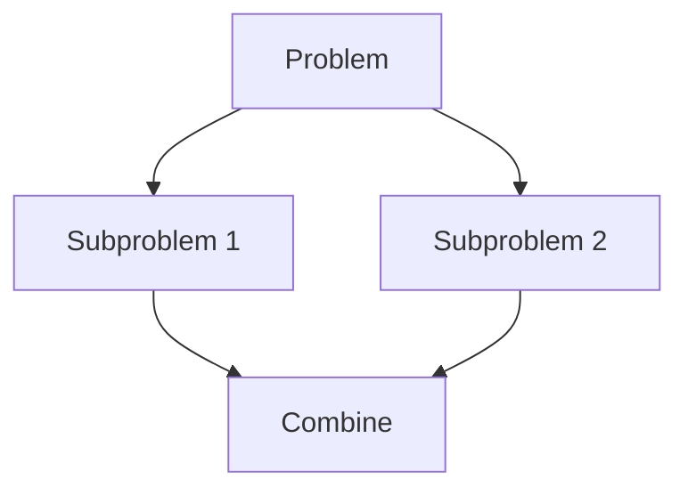

# Recursion & Divide and Conquer Pattern

## What is it?
A technique for breaking a problem into smaller subproblems, solving them recursively, and combining results.

## When to Use
- Merge sort, quick sort
- Tree problems
- Problems that can be split into independent subproblems

## Pseudocode
```text
def divide_and_conquer(problem):
    if base_case:
        return solution
    left = divide_and_conquer(subproblem1)
    right = divide_and_conquer(subproblem2)
    return combine(left, right)
```

## Classic LeetCode Examples
- [Merge Sort (LC 912)](https://leetcode.com/problems/sort-an-array/)
- [Maximum Subarray (LC 53)](https://leetcode.com/problems/maximum-subarray/)

### Example: Merge Sort
```python
def merge_sort(arr):
    if len(arr) <= 1:
        return arr
    mid = len(arr) // 2
    left = merge_sort(arr[:mid])
    right = merge_sort(arr[mid:])
    return merge(left, right)

def merge(left, right):
    result = []
    i = j = 0
    while i < len(left) and j < len(right):
        if left[i] < right[j]:
            result.append(left[i])
            i += 1
        else:
            result.append(right[j])
            j += 1
    result.extend(left[i:])
    result.extend(right[j:])
    return result
```

## Tips
- Always define a clear base case
- Combine results from subproblems

## Mermaid Diagram


