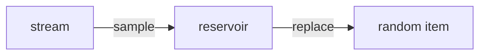

# Reservoir Sampling Pattern

## What is it?
A technique for randomly sampling k items from a stream or large dataset of unknown size.

## When to Use
- Random sampling from a stream
- Large datasets where n is unknown or too large to store

## Pseudocode
```text
reservoir = []
for i, item in enumerate(stream):
    if i < k:
        reservoir.append(item)
    else:
        j = random.randint(0, i)
        if j < k:
            reservoir[j] = item
```

## Classic LeetCode Examples
- [Linked List Random Node (LC 382)](https://leetcode.com/problems/linked-list-random-node/)
- [Random Pick Index (LC 398)](https://leetcode.com/problems/random-pick-index/)

### Example: Reservoir Sampling
```python
import random

def reservoir_sampling(stream, k):
    reservoir = []
    for i, item in enumerate(stream):
        if i < k:
            reservoir.append(item)
        else:
            j = random.randint(0, i)
            if j < k:
                reservoir[j] = item
    return reservoir
```

## Tips
- Use for random sampling from unknown/large streams
- Each item has equal probability

## Mermaid Diagram


