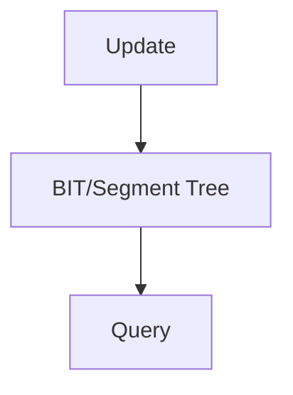

# Segment Tree / Fenwick Tree Pattern

## What is it?
Advanced data structures for efficient range queries and updates (sum, min, max) in arrays.

## When to Use
- Range sum/min/max queries
- Range updates

## Pseudocode (Fenwick Tree)
```text
def update(bit, i, val):
    while i < len(bit):
        bit[i] += val
        i += i & -i

def query(bit, i):
    res = 0
    while i > 0:
        res += bit[i]
        i -= i & -i
    return res
```

## Classic LeetCode Examples
- [Range Sum Query - Mutable (LC 307)](https://leetcode.com/problems/range-sum-query-mutable/)
- [Count of Smaller Numbers After Self (LC 315)](https://leetcode.com/problems/count-of-smaller-numbers-after-self/)

### Example: Fenwick Tree
```python
class FenwickTree:
    def __init__(self, size):
        self.bit = [0] * (size + 1)
    def update(self, i, val):
        while i < len(self.bit):
            self.bit[i] += val
            i += i & -i
    def query(self, i):
        res = 0
        while i > 0:
            res += self.bit[i]
            i -= i & -i
        return res
```

## Tips
- Segment tree is more flexible, Fenwick tree is simpler
- Both use O(n) space and O(log n) query/update

## Mermaid Diagram


