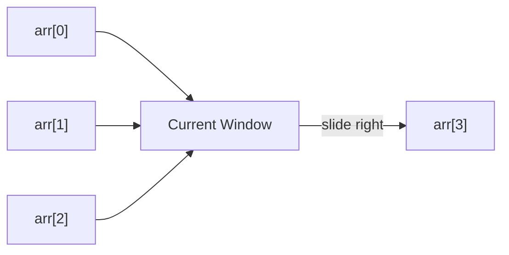

# Sliding Window Pattern

## What is it?
A technique for solving problems involving contiguous subarrays or substrings in linear time by maintaining a window that slides over the data structure.

## When to Use
- Find the maximum/minimum sum of a subarray of size k
- Longest substring with at most k distinct characters
- Problems involving subarrays/substrings with constraints

## Pseudocode
```text
Initialize window_start = 0
For window_end in range(len(array)):
    Expand the window (add array[window_end])
    While window does not satisfy constraints:
        Shrink the window from the left (increment window_start)
    Update result if needed
```

## Classic LeetCode Examples
- [Maximum Sum Subarray of Size K (LC 643)](https://leetcode.com/problems/maximum-average-subarray-i/)
- [Longest Substring Without Repeating Characters (LC 3)](https://leetcode.com/problems/longest-substring-without-repeating-characters/)

### Example: Maximum Sum Subarray of Size K
```python
def max_sum_subarray(arr, k):
    max_sum, window_sum = 0, 0
    window_start = 0
    for window_end in range(len(arr)):
        window_sum += arr[window_end]
        if window_end >= k - 1:
            max_sum = max(max_sum, window_sum)
            window_sum -= arr[window_start]
            window_start += 1
    return max_sum
```

## Tips
- Use a hash map for variable-length window problems (e.g., longest substring with k distinct chars)
- Fixed-size window: simple sum/count
- Variable-size window: use while loop to shrink window

## Mermaid Diagram

