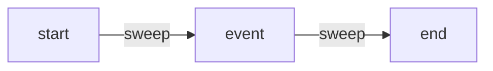

# Sweep Line Algorithm Pattern

## What is it?
A technique for solving interval and geometry problems by "sweeping" a line across the plane and processing events in order.

## When to Use
- Interval overlap/counting
- Geometry problems (e.g., skyline)

## Pseudocode
```text
events = []
for interval in intervals:
    events.append((interval.start, 'start'))
    events.append((interval.end, 'end'))
events.sort()
active = 0
for time, typ in events:
    if typ == 'start':
        active += 1
    else:
        active -= 1
```

## Classic LeetCode Examples
- [The Skyline Problem (LC 218)](https://leetcode.com/problems/the-skyline-problem/)
- [Meeting Rooms II (LC 253)](https://leetcode.com/problems/meeting-rooms-ii/)

### Example: Meeting Rooms II
```python
def min_meeting_rooms(intervals):
    events = []
    for start, end in intervals:
        events.append((start, 1))
        events.append((end, -1))
    events.sort()
    active = 0
    max_rooms = 0
    for time, delta in events:
        active += delta
        max_rooms = max(max_rooms, active)
    return max_rooms
```

## Tips
- Sort events and process in order
- Use for interval overlap/counting

## Mermaid Diagram


