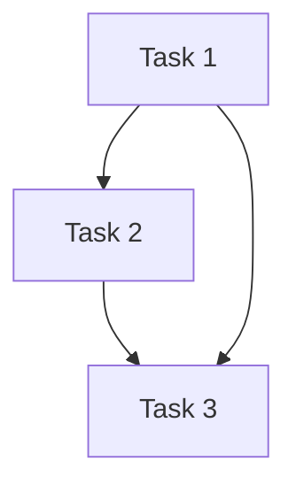

# Topological Sort Pattern

## What is it?
A technique for ordering nodes in a Directed Acyclic Graph (DAG) such that for every directed edge u → v, u comes before v.

## When to Use
- Scheduling tasks with dependencies
- Course prerequisites

## Pseudocode
```text
in_degree = {node: 0 for node in graph}
for node in graph:
    for neighbor in graph[node]:
        in_degree[neighbor] += 1
queue = [nodes with in_degree 0]
while queue:
    node = queue.pop(0)
    result.append(node)
    for neighbor in graph[node]:
        in_degree[neighbor] -= 1
        if in_degree[neighbor] == 0:
            queue.append(neighbor)
```

## Classic LeetCode Examples
- [Course Schedule (LC 207)](https://leetcode.com/problems/course-schedule/)
- [Course Schedule II (LC 210)](https://leetcode.com/problems/course-schedule-ii/)

### Example: Course Schedule II
```python
def find_order(num_courses, prerequisites):
    from collections import defaultdict, deque
    graph = defaultdict(list)
    in_degree = {i: 0 for i in range(num_courses)}
    for dest, src in prerequisites:
        graph[src].append(dest)
        in_degree[dest] += 1
    queue = deque([k for k in in_degree if in_degree[k] == 0])
    order = []
    while queue:
        node = queue.popleft()
        order.append(node)
        for neighbor in graph[node]:
            in_degree[neighbor] -= 1
            if in_degree[neighbor] == 0:
                queue.append(neighbor)
    return order if len(order) == num_courses else []
```

## Tips
- Only works for DAGs
- Use in-degree to track dependencies

## Mermaid Diagram

