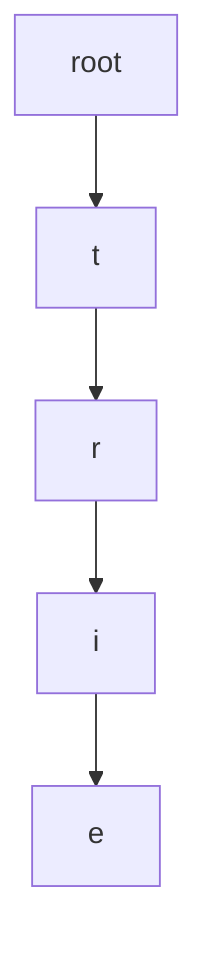

# Trie (Prefix Tree) Pattern

## What is it?
A tree-like data structure for storing strings, where each node represents a character of a word.

## When to Use
- Autocomplete
- Word search
- Dictionary problems

## Pseudocode
```text
class TrieNode:
    def __init__(self):
        self.children = {}
        self.is_end = False
class Trie:
    def __init__(self):
        self.root = TrieNode()
    def insert(self, word):
        node = self.root
        for char in word:
            if char not in node.children:
                node.children[char] = TrieNode()
            node = node.children[char]
        node.is_end = True
```

## Classic LeetCode Examples
- [Implement Trie (LC 208)](https://leetcode.com/problems/implement-trie-prefix-tree/)
- [Word Search II (LC 212)](https://leetcode.com/problems/word-search-ii/)

### Example: Implement Trie
```python
class TrieNode:
    def __init__(self):
        self.children = {}
        self.is_end = False
class Trie:
    def __init__(self):
        self.root = TrieNode()
    def insert(self, word):
        node = self.root
        for char in word:
            if char not in node.children:
                node.children[char] = TrieNode()
            node = node.children[char]
        node.is_end = True
```

## Tips
- Use for prefix-based search
- Each node can have up to 26 children (for lowercase letters)

## Mermaid Diagram


