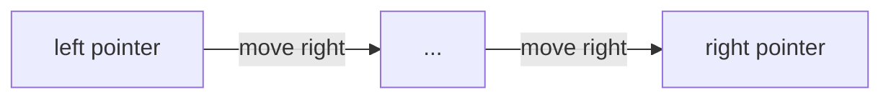

# Two Pointers Pattern

## What is it?
A technique where two pointers iterate through the data structure (often from both ends or at different speeds) to solve problems efficiently.

## When to Use
- Sorted arrays/lists for pair or triplet problems
- Linked list cycle detection
- Partitioning or rearranging arrays

## Pseudocode
```text
left = 0
right = len(array) - 1
while left < right:
    # Check or process array[left] and array[right]
    if condition:
        left += 1
    else:
        right -= 1
```

## Classic LeetCode Examples
- [Two Sum II - Input Array Is Sorted (LC 167)](https://leetcode.com/problems/two-sum-ii-input-array-is-sorted/)
- [Container With Most Water (LC 11)](https://leetcode.com/problems/container-with-most-water/)

### Example: Two Sum II
```python
def two_sum(numbers, target):
    left, right = 0, len(numbers) - 1
    while left < right:
        curr_sum = numbers[left] + numbers[right]
        if curr_sum == target:
            return [left + 1, right + 1]
        elif curr_sum < target:
            left += 1
        else:
            right -= 1
```

## Tips
- Use when the array is sorted
- Can be used for palindrome checks, partitioning, and more

## Mermaid Diagram

