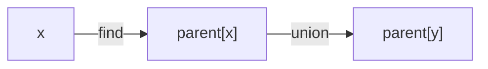

# Union Find (Disjoint Set) Pattern

## What is it?
A data structure for efficiently tracking and merging disjoint sets, useful for connected components and cycle detection.

## When to Use
- Connected components in graphs
- Cycle detection in undirected graphs

## Pseudocode
```text
parent = [i for i in range(n)]
def find(x):
    if parent[x] != x:
        parent[x] = find(parent[x])
    return parent[x]
def union(x, y):
    parent[find(x)] = find(y)
```

## Classic LeetCode Examples
- [Number of Connected Components in an Undirected Graph (LC 323)](https://leetcode.com/problems/number-of-connected-components-in-an-undirected-graph/)
- [Redundant Connection (LC 684)](https://leetcode.com/problems/redundant-connection/)

### Example: Union Find
```python
def find(parent, x):
    if parent[x] != x:
        parent[x] = find(parent, parent[x])
    return parent[x]
def union(parent, x, y):
    parent[find(parent, x)] = find(parent, y)
```

## Tips
- Use path compression for efficiency
- Good for Kruskal's MST, connected components

## Mermaid Diagram


